# Результат на 23.04

# Результат на 25.04
Начал делаьб GUI. Сделал пока вывод того, что принимает COM-port. Подключил ESP для теста - всё работает:

# Результат на 27.04
Прогресс по GUI. Сделал вывод на график, использовал библиотеку **pyqtgraph**. Были проблемы с чтением - данные посылаются от STM с частотой около 1000 Гц (Но они решились частично). На фото результат работы АЦП и микрофона (и моего мычания). Необходимо проверть достоверность с помощью analog discovery.

# Результат на 25.04
Ускорил передачу с STM. изменил GUI, сейяас в пакете два сигнала с АЦП. Могу увидеть частоту 1кГц. ОДнако это всё еще не уровень Analog Discovery 

# Результат на 26.05
Проверка ускоренной передачи - шумы мешают

# Результат на 27.05
Шумы уже не так мешают при правильной настройке фильтра. Частоту дискретизации брать исходя из частоты получения даныых (10 kHz смотри на рисунке)  Тестирую с металлическим диском:

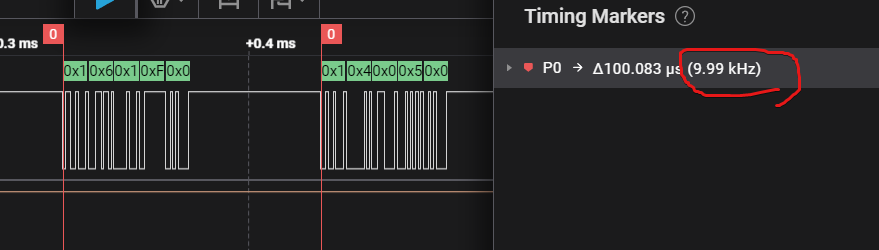

# 29.05
Пробую пока в MATLAB написать код для филтрации и расознавания частоты

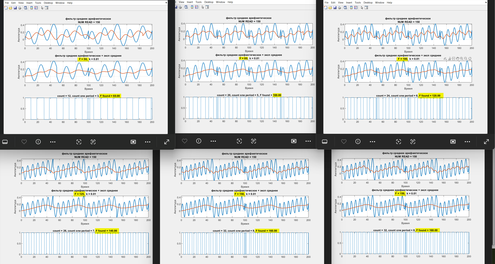

# 30.05
Заверишл разрабокту модульных проектов,теперь надо связать в один проект
- Приём по уарт с заданной скоросотью UART_test
- ЦАП с удобной настройкой сигнала DAC_test
- Алгоритм по определению частоты в Matlab

# 01.06

Собрал модульные проекты в один - всё работает:
- **добавил DAC** 
- **добавил управление OpAMP Gain из GUI**
    иногда зависало, помогло чекать ошибки уарта и таймаут. Также необходимо изменить приоритет прерываний: DMA 1, UART 0

Теперь нет прямой необходимости работать с analog discovery. 

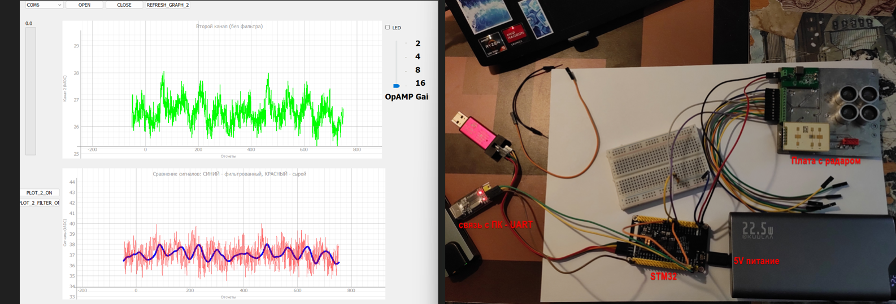

Черновой вариант определения частоты, оня прям очень похожа на дальность в сантиметрах. 
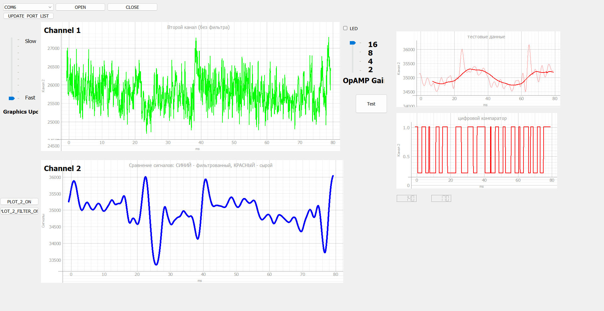

# 02.06 Испытания
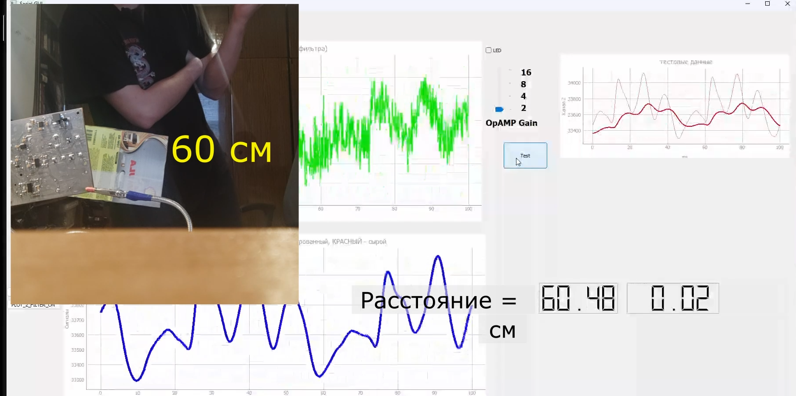
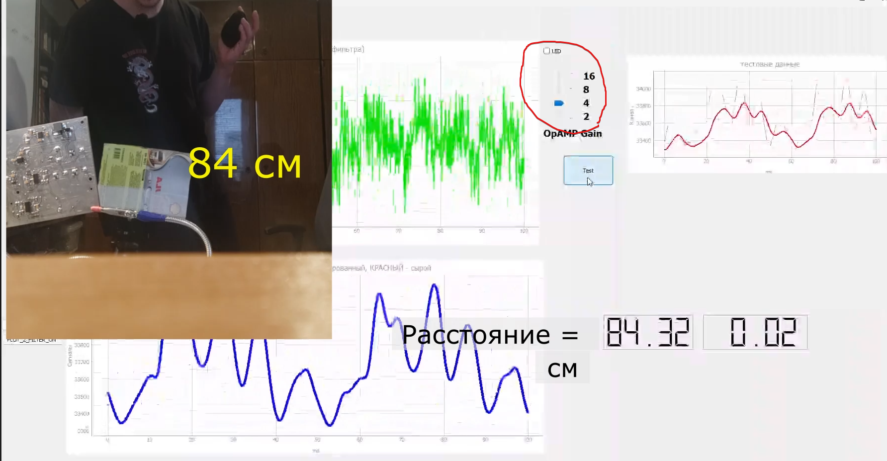
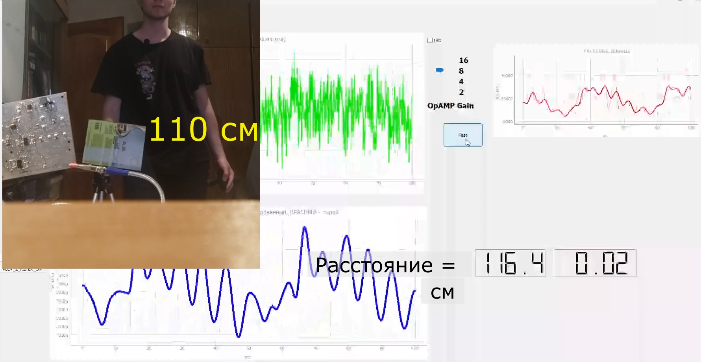
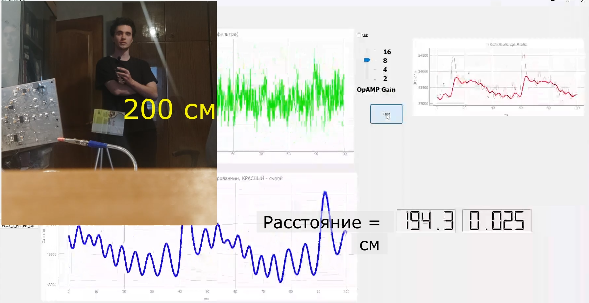

БПФ пока в разработке. Кажется, для точности можно получше адаптировать коф.эксп.фильтрации и будет норм. Еще надо добавит второй канал.   

# 05.06
Сделал хорошее совмещение графиков то есть определение длинны на большом расстоянии
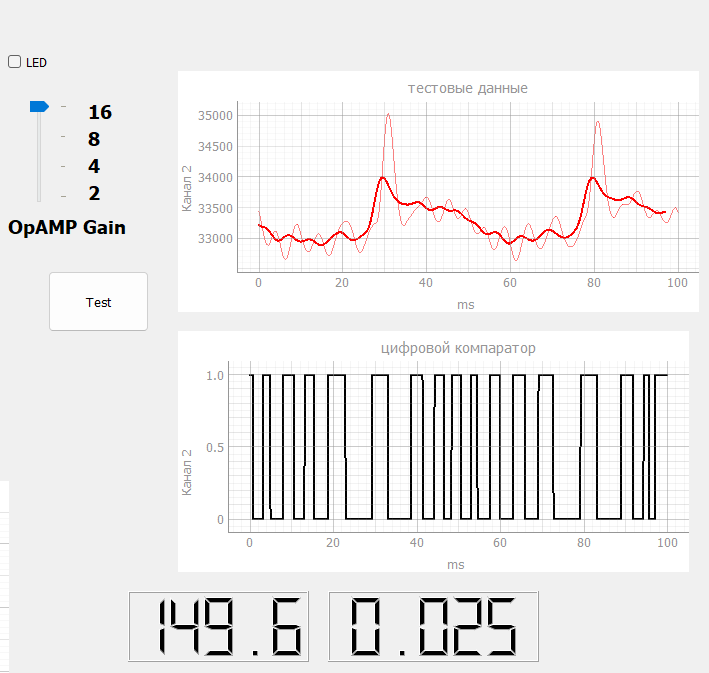

# 06.06
Сделал обратну связь с подтвержднием от STM об изменении коэффициента усиления, теперь хорошо меняется.
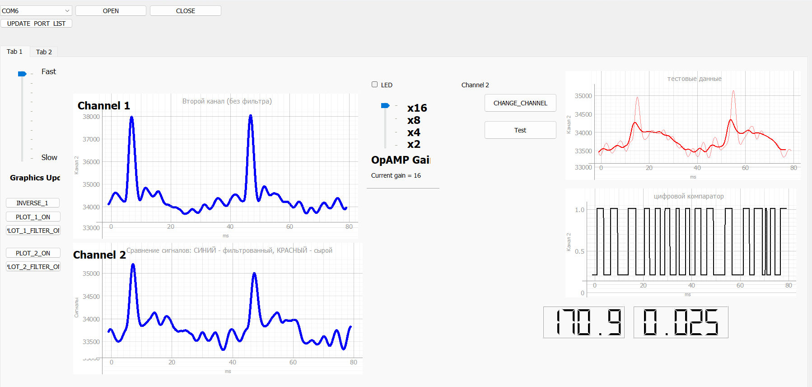

# 08.06
Обновил пакет
теперь можно включать и выключать радар по кнопке на платe и из приложения.

Надо проверить на наличие ошибок 

**Задачи**:
- реализовать автоматическую настройку коэффициента усиления
- реализовать корректное опеределение ближней дистанции (сейчас только дальняя хорошо определяется)
- алгоритм поиска фазы
- привести код и интерфейс в порядок

Была ошибка в определении дистанции, сейчас дистанция учитыват параметры радара и формула для расчёта, а не просто частоту. 

# 12.06
Внёс исправления 

# 14.06
Функции общения с СТМ32 работают хорошо(включение/выключение, а также изменения коэф усиления), так как я добавил таймер с подтверждением.
Добавил АРУ. Добавил изменяемую частоту среза, для большей дальности. Бьёт на 3.5 м. Определят растония корректно.
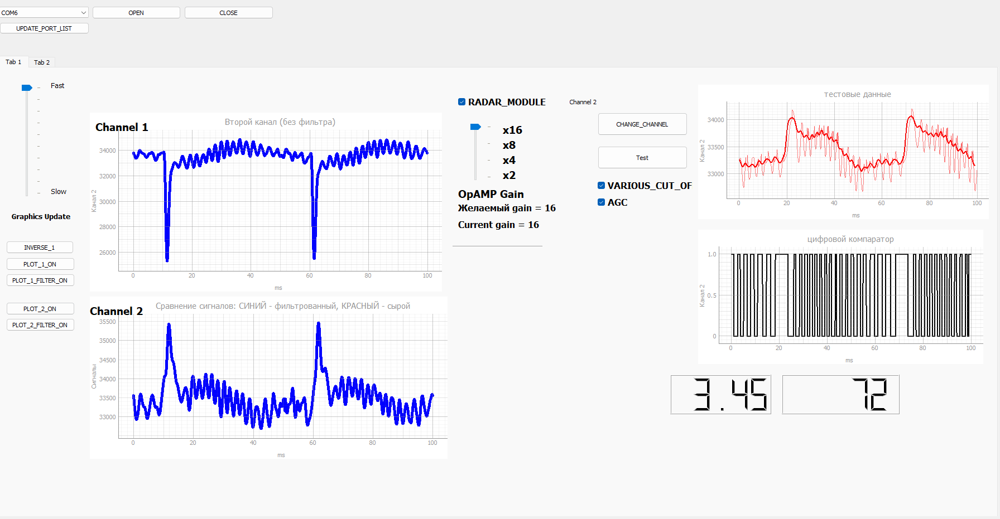
