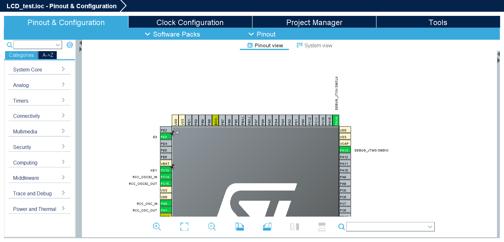
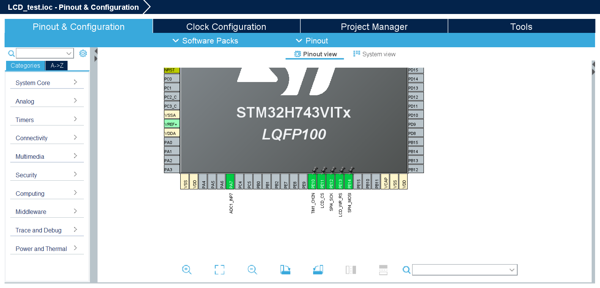
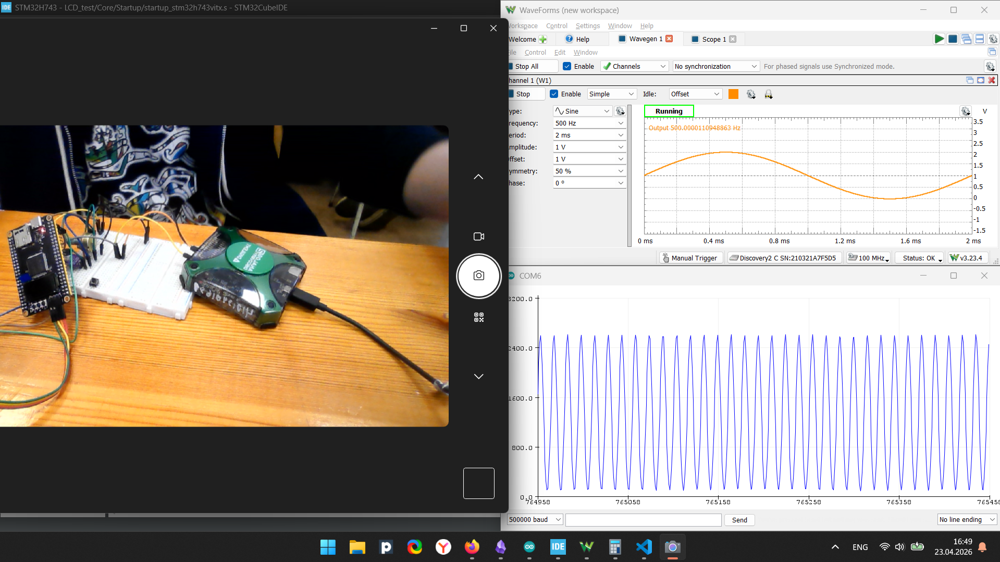
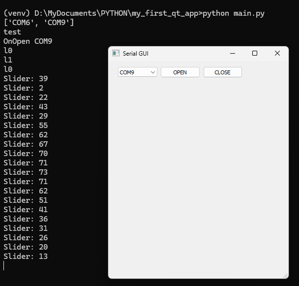
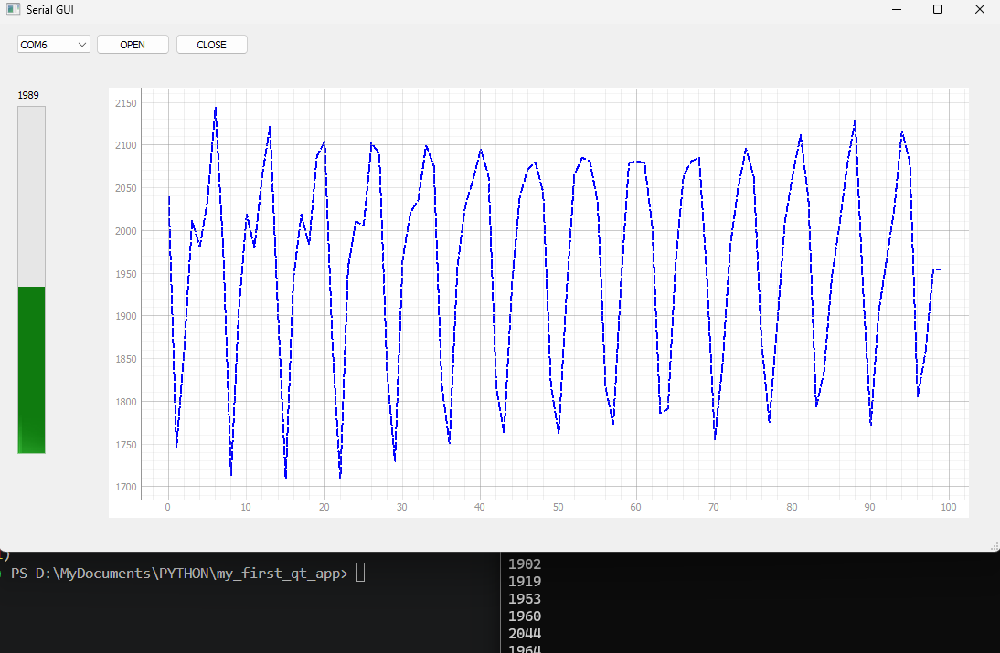
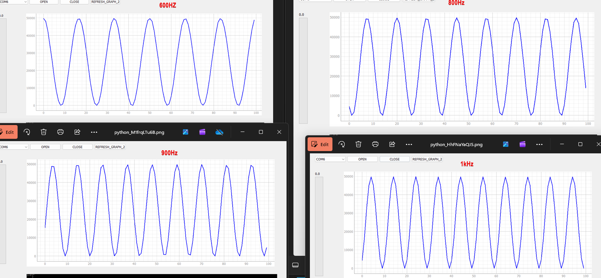
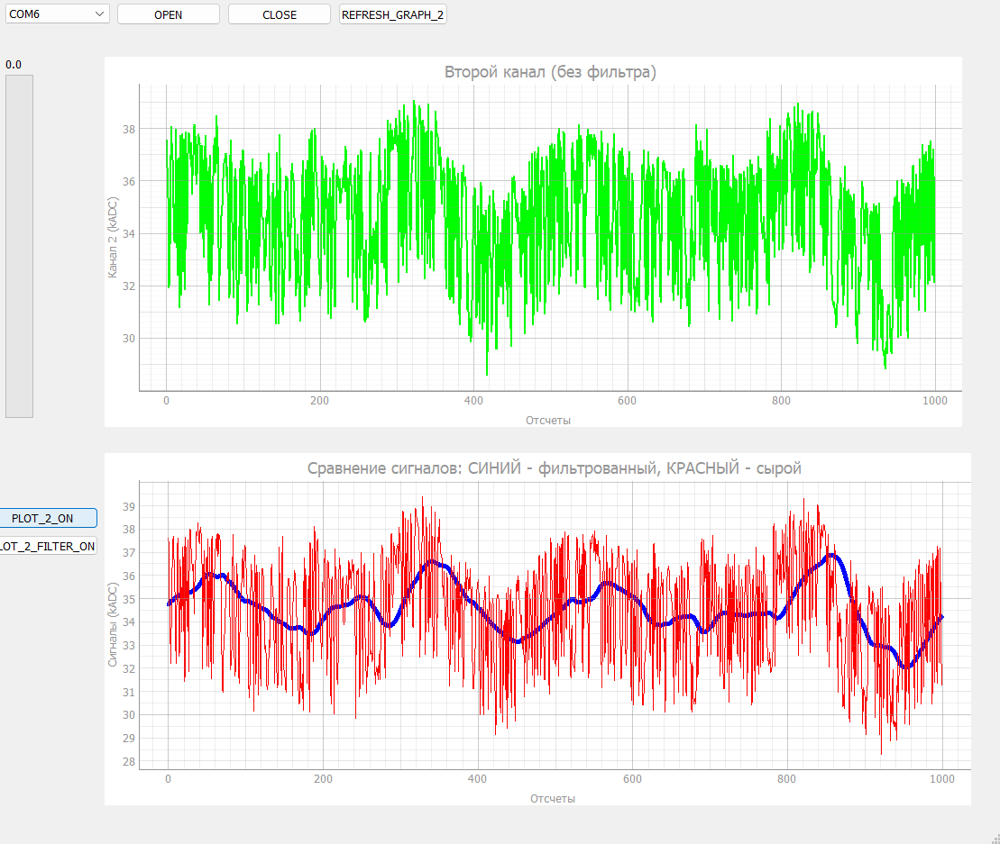
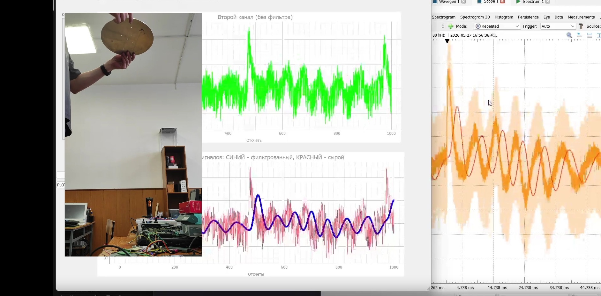

# Результат на 23.04

# Результат на 25.04
Начал делаьб GUI. Сделал пока вывод того, что принимает COM-port. Подключил ESP для теста - всё работает:

# Результат на 27.04
Прогресс по GUI. Сделал вывод на график, использовал библиотеку **pyqtgraph**. Были проблемы с чтением - данные посылаются от STM с частотой около 1000 Гц (Но они решились частично). На фото результат работы АЦП и микрофона (и моего мычания). Необходимо проверть достоверность с помощью analog discovery.

# Результат на 25.04
Ускорил передачу с STM. изменил GUI, сейяас в пакете два сигнала с АЦП. Могу увидеть частоту 1кГц. ОДнако это всё еще не уровень Analog Discovery 

# Результат на 26.05
Проверка ускоренной передачи - шумы мешают

# Результат на 27.05
Шумы уже не так мешают при правильной настройке фильтра. Частоту дискретизации брать исходя из частоты получения даныых (10 kHz смотри на рисунке)  Тестирую с металлическим диском:

